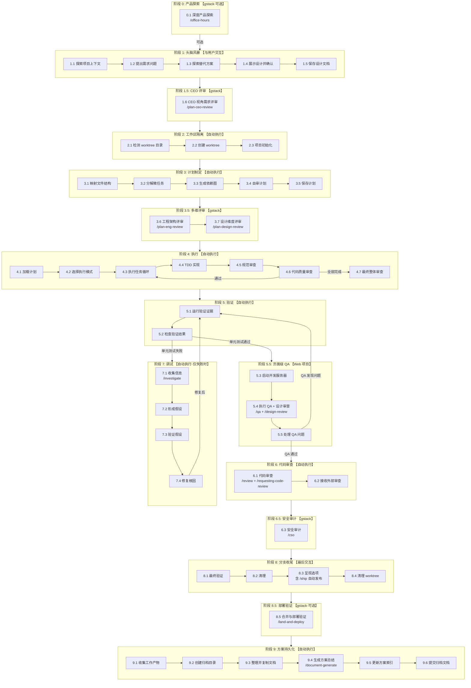

# Superpowers 工作流

一个 10 阶段软件工程工作流，将 AI 从"急于编码的实习生"转变为有纪律的工程团队。

> **来源**: [obra/superpowers](https://github.com/obra/superpowers) — 面向编码 Agent 的完整软件开发方法论（v5.1.0）。

> **增强**: [garrytan/gstack](https://github.com/garrytan/gstack) — Garry Tan 的 AI Builder 框架，提供产品探索、多维评审、安全审计、发布部署等 11 个增强 skill。

> ⚠️ **交互规则**: **仅在阶段 1（头脑风暴）与用户交互确认需求**。阶段 2-10 自动执行，非必要不询问用户。

> ⚠️ **执行规则**: **必须严格按照步骤编号顺序执行，不得跳过任何步骤。每完成一步打勾后才能进入下一步。**

---

## 完整执行步骤清单

以下是必须**严格按顺序**执行的完整步骤。每一步完成后才能进入下一步。

---

### 步骤 0.1 — 深度产品探索【阶段 0: 产品探索·gstack 增强】

> 🔗 **Skill**: [`gstack-office-hours`](./skills/gstack-office-hours/SKILL.md)
> — YC 创业辅导模式。通过六个强制性问题揭示需求真实性、现状替代方案、最窄切入点、观察洞察和未来适配性。适用于新功能想法、产品方向验证。

**⚠️ 当用户描述的是一个新功能想法或产品方向时，建议先执行此阶段。纯 Bug 修复或明确的技术任务可跳过。**

- [ ] **启动 Office Hours 模式**，选择合适模式：
  - **创业模式**：六个强制性问题（需求真实性、现状替代方案、绝望的具体性、最窄切入点、观察、未来适配）
  - **构建者模式**：面向副项目/黑客松/开源的设计思维头脑风暴
- [ ] 收集上下文：项目背景、目标用户、市场环境
- [ ] 探索问题空间：用户真正需要什么？为什么现有方案不够好？
- [ ] 生成设计文档（不写代码），保存到 `docs/plans/YYYY-MM-DD-<topic>-office-hours.md`

**阶段 0 完成 ✅ — 产品方向已验证，设计文档已生成**

---

### 步骤 1.1 — 探索项目上下文【阶段 1: 头脑风暴】

> 🔗 **Skill**: [`brainstorming`](./skills/brainstorming/SKILL.md)

- [ ] 检查当前项目状态（文件结构、文档、最近提交）
- [ ] 了解现有代码库的技术栈和架构

### 步骤 1.2 — 提出需求问题【阶段 1: 头脑风暴】

> 🔗 **Skill**: [`brainstorming`](./skills/brainstorming/SKILL.md)

- [ ] 向用户提出苏格拉底式问题（一次一个问题）：
  - 我们要解决什么问题？为谁解决？
  - 边界情况和约束条件是什么？
  - 成功的标准是什么？
  - 哪些现有代码/模块会受影响？
- [ ] 尽可能自行探索代码库回答问题，不要问用户你自己能发现的

### 步骤 1.3 — 探索替代方案【阶段 1: 头脑风暴】

> 🔗 **Skill**: [`brainstorming`](./skills/brainstorming/SKILL.md)

- [ ] 提出 2-3 种不同的实现方案
- [ ] 给出推荐方案及理由
- [ ] 分析每种方案的权衡（trade-offs）

### 步骤 1.4 — 展示设计并确认【阶段 1: 头脑风暴】

> 🔗 **Skill**: [`brainstorming`](./skills/brainstorming/SKILL.md)

- [ ] 将设计分成小节（200-300 字）逐步展示
- [ ] 每节后确认用户是否认可
- [ ] 覆盖：架构、组件、数据流、错误处理、测试策略
- [ ] **必须获得用户明确确认后才能进入步骤 2.1**

### 步骤 1.5 — 保存设计文档【阶段 1: 头脑风暴】

> 🔗 **Skill**: [`brainstorming`](./skills/brainstorming/SKILL.md)

- [ ] 将确认后的设计写入 `docs/plans/YYYY-MM-DD-<topic>-design.md`
- [ ] 提交设计文档到 git

**阶段 1 完成 ✅ — 需求已确认，设计已保存**

---

### 步骤 1.6 — CEO 视角需求评审【阶段 1.5: CEO 评审·gstack 增强】

> 🔗 **Skill**: [`gstack-plan-ceo-review`](./skills/gstack-plan-ceo-review/SKILL.md)
> — CEO/创始人视角的计划评审。重新审视问题本身，寻找十星级产品方案，挑战前提假设。四种模式：范围扩展、选择性扩展、保持范围、范围缩减。

- [ ] **启动 CEO 评审模式**，以创始人视角审视已确认的需求：
  - 我们在解决正确的问题吗？
  - 这个方案能成为十星级产品吗？
  - 有没有更大的机会被忽略了？
  - 前提假设是否站得住脚？
- [ ] 选择评审模式：
  - **范围扩展**：发现更大机会，扩大功能范围
  - **选择性扩展**：保留核心，扩展部分维度
  - **保持范围**：当前方案已经很好
  - **范围缩减**：聚焦最窄切入点，砍掉不必要的
- [ ] 将评审结论追加到设计文档
- [ ] **如果范围有变更** → 回到步骤 1.4 重新确认

**阶段 1.5 完成 ✅ — CEO 评审通过，需求范围已锁定**

---

### 步骤 2.1 — 检测 worktree 目录【阶段 2: 工作区隔离】

> 🔗 **Skill**: [`using-git-worktrees`](./skills/using-git-worktrees/SKILL.md)

- [ ] 按优先级检查 worktree 目录：`.worktrees/` → `worktrees/` → CLAUDE.md 配置
- [ ] 如果目录存在，验证是否已被 gitignore
- [ ] 如果目录不存在，自动创建 `.worktrees/` 并添加到 `.gitignore`

### 步骤 2.2 — 创建 worktree【阶段 2: 工作区隔离】

> 🔗 **Skill**: [`using-git-worktrees`](./skills/using-git-worktrees/SKILL.md)

- [ ] 创建功能分支：`git worktree add .worktrees/<feature-name> -b feature/<feature-name>`
- [ ] 切换到 worktree 目录

### 步骤 2.3 — 项目初始化【阶段 2: 工作区隔离】

> 🔗 **Skill**: [`using-git-worktrees`](./skills/using-git-worktrees/SKILL.md)

- [ ] 自动检测并安装依赖：
  - `package.json` → `npm install`
  - `Cargo.toml` → `cargo build`
  - `requirements.txt` / `pyproject.toml` → `pip install` / `poetry install`
  - `go.mod` → `go mod download`
- [ ] 运行测试验证干净基线
- [ ] 如果测试失败，报告失败并尝试修复；无法修复则通知用户

**阶段 2 完成 ✅ — 隔离工作区已就绪，测试基线干净**

---

### 步骤 3.1 — 映射文件结构【阶段 3: 计划制定】

> 🔗 **Skill**: [`writing-plans`](./skills/writing-plans/SKILL.md)

- [ ] 列出需要创建或修改的所有文件
- [ ] 为每个文件定义职责
- [ ] 确保文件边界清晰、职责单一
- [ ] 遵循现有代码库的命名和结构约定

### 步骤 3.2 — 分解微任务【阶段 3: 计划制定】

> 🔗 **Skill**: [`writing-plans`](./skills/writing-plans/SKILL.md)

- [ ] 将工作分解为微任务（每个 2-5 分钟）
- [ ] 为每个任务指定：
  - 目的（它实现什么）
  - 涉及的文件路径（创建/修改/测试）
  - 依赖关系（依赖哪些其他任务）
  - 预期输出
- [ ] 每个任务包含完整的代码和验证命令（不允许占位符）

### 步骤 3.3 — 生成依赖图【阶段 3: 计划制定】

> 🔗 **Skill**: [`writing-plans`](./skills/writing-plans/SKILL.md)

- [ ] 标记任务之间的依赖关系
- [ ] 标记可并行执行的任务（无依赖）
- [ ] 确定执行顺序

### 步骤 3.4 — 自审计划【阶段 3: 计划制定】

> 🔗 **Skill**: [`writing-plans`](./skills/writing-plans/SKILL.md)

- [ ] **规范覆盖检查**：对照设计文档，每个需求都有对应任务吗？
- [ ] **占位符扫描**：搜索 TBD、TODO、implement later 等占位符
- [ ] **类型一致性检查**：后续任务中的类型、方法签名是否与前面定义一致？
- [ ] 发现问题立即修复

### 步骤 3.5 — 保存计划【阶段 3: 计划制定】

> 🔗 **Skill**: [`writing-plans`](./skills/writing-plans/SKILL.md)

- [ ] 将计划保存到 `docs/superpowers/plans/YYYY-MM-DD-<feature-name>.md`
- [ ] 提交计划文档到 git

**阶段 3 完成 ✅ — 计划已生成并保存**

---

### 步骤 3.6 — 工程架构评审【阶段 3.5: 工程评审·gstack 增强】

> 🔗 **Skill**: [`gstack-plan-eng-review`](./skills/gstack-plan-eng-review/SKILL.md)
> — 工程经理视角的计划评审。锁定执行计划：架构、数据流、边界情况、测试覆盖、性能。以交互方式逐步审查问题并给出有主见的建议。

- [ ] **启动工程评审模式**，以工程经理视角审查计划：
  - 架构是否合理？组件边界是否清晰？
  - 数据流是否完整？有无遗漏的状态转换？
  - 边界情况是否覆盖？错误处理是否充分？
  - 测试策略是否完备？覆盖率目标是否合理？
  - 性能瓶颈在哪里？有无必要的优化？
- [ ] 逐步审查每个微任务，给出改进建议
- [ ] **审查通过** → 进入步骤 3.7
- [ ] **审查发现问题** → 修复计划后重新审查

### 步骤 3.7 — 设计维度评审【阶段 3.5: 设计评审·gstack 增强】

> 🔗 **Skill**: [`gstack-plan-design-review`](./skills/gstack-plan-design-review/SKILL.md)
> — 设计师视角的计划评审。对每个设计维度进行 0-10 评分，解释如何达到满分，然后修正计划以达到目标。

**⚠️ 仅当项目涉及 UI/UX 变更时执行此步骤。纯后端/CLI 项目可跳过。**

- [ ] **启动设计评审模式**，以设计师视角审查计划：
  - 对以下维度进行 0-10 评分：
    - 视觉一致性、间距与排版、色彩系统
    - 交互反馈、动画流畅度、响应式适配
    - 可访问性（a11y）、品牌一致性
    - AI Slop 检测（是否使用了过度 AI 风格的设计）
  - 每个维度：解释当前得分 + 如何达到满分
- [ ] 根据评审结果修正计划中的 UI 相关任务
- [ ] **审查通过** → 进入步骤 4.1

**阶段 3.5 完成 ✅ — 工程和设计评审通过，计划已锁定**

---

### 步骤 4.1 — 加载计划并创建任务列表【阶段 4: 执行】

> 🔗 **Skill**: [`subagent-driven-development`](./skills/subagent-driven-development/SKILL.md)

- [ ] 读取计划文件
- [ ] 提取所有任务的完整文本和上下文
- [ ] 创建 TodoWrite 任务列表

### 步骤 4.2 — 选择执行模式【阶段 4: 执行】

> 🔗 **Skill**: [`subagent-driven-development`](./skills/subagent-driven-development/SKILL.md) / [`executing-plans`](./skills/executing-plans/SKILL.md) / [`dispatching-parallel-agents`](./skills/dispatching-parallel-agents/SKILL.md)

- [ ] 根据任务依赖关系自动选择执行模式：
  - **任务之间有依赖** → 顺序执行（步骤 4.3a）
  - **任务之间无依赖** → 并行执行（步骤 4.3b）
  - **混合（部分有依赖，部分无依赖）** → 子 Agent 驱动开发（步骤 4.3c）

### 步骤 4.3a — 顺序执行【当任务有依赖时】

> 🔗 **Skill**: [`executing-plans`](./skills/executing-plans/SKILL.md)

对每个任务按顺序执行步骤 4.4 → 4.5 → 4.6：

- [ ] 取依赖链中的下一个任务
- [ ] 执行步骤 4.4（TDD 实现）
- [ ] 执行步骤 4.5（规范审查）
- [ ] 执行步骤 4.6（代码质量审查）
- [ ] 标记任务完成，进入下一个任务

### 步骤 4.3b — 并行执行【当任务无依赖时】

> 🔗 **Skill**: [`dispatching-parallel-agents`](./skills/dispatching-parallel-agents/SKILL.md)

- [ ] 识别所有可同时运行的任务
- [ ] 为每个任务启动独立子 Agent
- [ ] 每个子 Agent 内部执行步骤 4.4 → 4.5 → 4.6
- [ ] 收集所有结果，验证无冲突
- [ ] 运行完整测试套件确认集成正确

### 步骤 4.3c — 子 Agent 驱动开发【混合模式】

> 🔗 **Skill**: [`subagent-driven-development`](./skills/subagent-driven-development/SKILL.md)

- [ ] 按依赖顺序处理任务
- [ ] 对每组可并行的任务，同时启动多个子 Agent
- [ ] 每个子 Agent 内部执行步骤 4.4 → 4.5 → 4.6
- [ ] 每个任务完成后进入下一个

### 步骤 4.4 — TDD 实现【每个任务的编码步骤】

> 🔗 **Skill**: [`test-driven-development`](./skills/test-driven-development/SKILL.md)

对每个任务，严格执行以下循环：

- [ ] **RED**: 编写一个失败的测试
  - 一次只写一个测试（垂直切片）
  - 测试验证行为，不验证实现细节
  - 测试名称清晰描述行为
- [ ] **验证 RED**: 运行测试，确认测试失败（不是报错）
  - 测试通过了？→ 修复测试，它测的是已有行为
  - 测试报错了？→ 修复语法错误后重试
- [ ] **GREEN**: 编写最少代码使测试通过
  - 不添加额外功能
  - 不做重构
- [ ] **验证 GREEN**: 运行测试，确认测试通过
  - 其他测试也必须通过
- [ ] **REFACTOR**: 改进代码结构
  - 仅在 GREEN 状态下重构
  - 重构后测试仍然通过
- [ ] **提交**: `git commit -m "feat: <描述>"`
- [ ] 如果还有更多行为要实现，重复 RED → GREEN → REFACTOR 循环

### 步骤 4.5 — 规范符合性审查【每个任务完成后】

> 🔗 **Skill**: [`subagent-driven-development`](./skills/subagent-driven-development/SKILL.md)（spec-reviewer）

- [ ] 启动规范审查子 Agent
- [ ] 审查实现是否完全符合计划规范：
  - 所有计划中的功能都已实现？
  - 没有添加计划外的功能？
  - 文件路径和接口与计划一致？
- [ ] **审查通过** → 进入步骤 4.6
- [ ] **审查不通过** → 返回步骤 4.4 修复，然后重新审查

### 步骤 4.6 — 代码质量审查【规范通过后】

> 🔗 **Skill**: [`requesting-code-review`](./skills/requesting-code-review/SKILL.md)

- [ ] 启动代码质量审查子 Agent
- [ ] 审查代码质量：
  - **严重**: 安全漏洞、数据丢失风险、崩溃
  - **高**: 逻辑错误、缺少错误处理、竞态条件
  - **中**: 代码重复、命名不佳、缺少测试
  - **低**: 风格不一致、轻微优化
- [ ] **审查通过** → 标记任务完成，进入下一个任务
- [ ] **审查不通过** → 返回步骤 4.4 修复，然后重新审查

### 步骤 4.7 — 最终整体审查【所有任务完成后】

> 🔗 **Skill**: [`requesting-code-review`](./skills/requesting-code-review/SKILL.md)

- [ ] 启动最终代码审查子 Agent，审查整个实现
- [ ] 对照计划确认所有需求已满足
- [ ] 确认所有测试通过
- [ ] 确认无遗留问题

**阶段 4 完成 ✅ — 所有任务已实现并通过审查**

---

### 步骤 5.1 — 运行验证证据【阶段 5: 验证】

> 🔗 **Skill**: [`verification-before-completion`](./skills/verification-before-completion/SKILL.md)

- [ ] 运行完整测试套件，获取新鲜输出
- [ ] 运行构建命令，确认构建成功
- [ ] 运行 lint 检查，确认无错误
- [ ] 如有 UI 变更，截图保存

### 步骤 5.2 — 检查验证结果【阶段 5: 验证】

> 🔗 **Skill**: [`verification-before-completion`](./skills/verification-before-completion/SKILL.md)

- [ ] **所有验证通过** → 进入步骤 5.3
- [ ] **验证失败** → 进入步骤 7.1（调试）

**阶段 5 完成 ✅ — 单元测试验证通过**

---

### 步骤 5.3 — 启动开发服务器【阶段 5.5: 页面级 QA 测试】

> 🔗 **Skill**: [`qa`](./skills/qa/SKILL.md)
> — 真实页面 QA 测试。像真实用户一样测试 Web 应用，点击所有内容、填写每个表单、检查每个状态。发现 Bug 后在源代码中修复并重新验证。

**⚠️ 仅当项目有 Web 界面时执行此阶段。纯后端/CLI 项目可跳过。**

- [ ] 检测项目类型并启动开发服务器：
  - Node.js/Next.js: `npm run dev` (通常端口 3000)
  - Node.js/Vite: `npm run dev` (通常端口 5173)
  - Python/Django: `python manage.py runserver` (端口 8000)
  - Python/Flask: `flask run` (端口 5000)
  - Ruby/Rails: `rails server` (端口 3000)
  - Go: `go run` (根据配置)
- [ ] 等待服务器启动并确认可访问
- [ ] 记录服务器 URL (如 `http://localhost:3000`)

### 步骤 5.4 — 执行 QA 测试【阶段 5.5: 页面级 QA 测试】

> 🔗 **Skill**: [`qa`](./skills/qa/SKILL.md) + [`gstack-design-review`](./skills/gstack-design-review/SKILL.md)

- [ ] **调用 `/qa` skill** 进行端到端测试：
  - 目标 URL: 开发服务器地址
  - 测试层级: Standard (默认) / Quick (紧急) / Exhaustive (发布前)
  - 测试范围: 全应用或变更相关页面
- [ ] QA 测试内容：
  - 页面加载和渲染
  - 用户交互（点击、表单、导航）
  - 响应式布局
  - 错误处理
  - 性能问题
- [ ] **调用 `/design-review` skill** 进行视觉审查（Web 项目）：
  - 发现视觉不一致、间距问题、层级问题
  - AI Slop 检测（过度渐变、阴影、圆角等 AI 生成痕迹）
  - 慢交互检测（动画卡顿、延迟反馈）
  - 在源代码中修复发现的问题，原子提交并重新验证

### 步骤 5.5 — 处理 QA 发现的问题【阶段 5.5: 页面级 QA 测试】

> 🔗 **Skill**: [`qa`](./skills/qa/SKILL.md)

- [ ] **QA 通过（无问题）** → 进入步骤 6.1
- [ ] **QA 发现问题** → 自动修复：
  1. 根据问题严重级别（严重/高/中/低）决定是否立即修复
  2. 在源代码中修复 Bug
  3. 原子提交: `git commit -m "fix: <问题描述>"`
  4. 重新运行步骤 5.1（单元测试验证）
  5. 重新运行步骤 5.4（QA 测试）直到通过

**阶段 5.5 完成 ✅ — 页面级 QA 测试通过**

---

### 步骤 6.1 — 代码审查【阶段 6: 代码审查】

> 🔗 **Skill**: [`requesting-code-review`](./skills/requesting-code-review/SKILL.md) + [`gstack-review`](./skills/gstack-review/SKILL.md)
> — 增强代码审查：除常规质量审查外，额外检查 SQL 安全性、LLM 信任边界违规、条件副作用及其他结构性问题。

- [ ] 生成独立审查子 Agent
- [ ] **常规审查**：按严重级别审查代码（安全漏洞、逻辑错误、代码质量）
- [ ] **gstack 增强审查**：
  - SQL 注入风险检查
  - LLM 信任边界违规（用户输入直接传递给 LLM）
  - 条件副作用（条件分支中的隐藏副作用）
  - 结构性问题（循环依赖、过度耦合）
- [ ] **审查通过** → 进入步骤 6.2
- [ ] **审查发现问题** → 自动修复严重和高优先级问题 → 重新运行步骤 5.1 验证

### 步骤 6.2 — 接收外部审查【如适用】

> 🔗 **Skill**: [`receiving-code-review`](./skills/receiving-code-review/SKILL.md)

- [ ] 仔细阅读每条外部审查评论
- [ ] 技术验证每条建议是否正确
- [ ] 处理或明确确认每条评论
- [ ] 修复后重新运行步骤 5.1 验证

**阶段 6 完成 ✅ — 代码审查通过**

---

### 步骤 6.3 — 安全审计【阶段 6.5: 安全审计·gstack 增强】

> 🔗 **Skill**: [`gstack-cso`](./skills/gstack-cso/SKILL.md)
> — 首席安全官模式。基础设施优先的安全审计：密钥考古、依赖供应链、CI/CD 管道安全、LLM/AI 安全、OWASP Top 10、STRIDE 威胁建模。

- [ ] **启动 CSO 审计模式**，选择审计级别：
  - **日常模式**：零噪音，8/10 置信度门槛，仅报告高置信度问题
  - **全面模式**：月度深度扫描，2/10 门槛，全面覆盖
- [ ] 执行安全检查：
  - 密钥考古：扫描硬编码密钥、密码、Token
  - 依赖供应链：检查已知漏洞依赖
  - CI/CD 管道安全：审查构建和部署配置
  - LLM/AI 安全：检查 Prompt 注入风险、信任边界
  - OWASP Top 10：常见 Web 安全漏洞
  - STRIDE 威胁建模：系统性威胁分析
- [ ] **审计通过（无高/严重问题）** → 进入步骤 7.1
- [ ] **发现问题** → 修复安全问题 → 重新运行步骤 5.1 验证

**阶段 6.5 完成 ✅ — 安全审计通过**

---

### 步骤 7.1 — 收集信息【阶段 7: 调试 — 仅在验证失败时执行】

> 🔗 **Skill**: [`systematic-debugging`](./skills/systematic-debugging/SKILL.md) + [`gstack-investigate`](./skills/gstack-investigate/SKILL.md)
> — 增强调试：除系统化调试外，额外提供四阶段根因调查框架（调查→分析→假设→实现），铁律：没有根因就不做修复。

- [ ] 可靠地重现 Bug
- [ ] 收集错误消息、日志、堆栈跟踪
- [ ] 识别最小重现案例
- [ ] 检查最近的代码变更

### 步骤 7.2 — 形成假设【阶段 7: 调试】

> 🔗 **Skill**: [`systematic-debugging`](./skills/systematic-debugging/SKILL.md)

- [ ] 列出可能的根因（按可能性排序）
- [ ] 对每个假设预测预期观察结果

### 步骤 7.3 — 验证假设【阶段 7: 调试】

> 🔗 **Skill**: [`systematic-debugging`](./skills/systematic-debugging/SKILL.md)

- [ ] 添加有针对性的日志 / 插桩
- [ ] 测试每个假设
- [ ] 消除与证据不符的假设

### 步骤 7.4 — 修复根因【阶段 7: 调试】

> 🔗 **Skill**: [`systematic-debugging`](./skills/systematic-debugging/SKILL.md)

- [ ] 修复实际根因（不是症状）
- [ ] 添加回归测试
- [ ] 验证修复不破坏其他功能
- [ ] **修复后返回步骤 5.1 重新验证**

**阶段 7 完成 ✅ — Bug 已修复并验证**

---

### 步骤 8.1 — 最终验证【阶段 8: 分支收尾】

> 🔗 **Skill**: [`finishing-a-development-branch`](./skills/finishing-a-development-branch/SKILL.md)

- [ ] 运行完整测试套件 → 全部通过
- [ ] 运行构建 → 成功
- [ ] 运行 lint → 无错误
- [ ] 检查无遗留 TODO/FIXME

### 步骤 8.2 — 清理【阶段 8: 分支收尾】

> 🔗 **Skill**: [`finishing-a-development-branch`](./skills/finishing-a-development-branch/SKILL.md)

- [ ] 清理临时文件
- [ ] 整理代码格式

### 步骤 8.3 — 呈现选项【阶段 8: 分支收尾 — 与用户交互】

> 🔗 **Skill**: [`finishing-a-development-branch`](./skills/finishing-a-development-branch/SKILL.md) + [`gstack-ship`](./skills/gstack-ship/SKILL.md)
> — 增强发布：除常规分支选项外，可选择全自动发布流水线（检测基础分支、运行测试、更新 VERSION/CHANGELOG、创建 PR）。

- [ ] 向用户呈现选项：
  1. **合并** — 直接合并到目标分支
  2. **创建 PR** — 为团队审查打开 Pull Request
  3. **保留** — 将分支保持原样供以后使用
  4. **丢弃** — 如果不再需要此工作则删除分支
  5. **🚀 自动发布（gstack /ship）** — 全自动发布流水线：
     - 检测并合并基础分支
     - 运行完整测试套件
     - 审查 diff
     - 更新 VERSION 和 CHANGELOG
     - 提交、推送、创建 PR
- [ ] 执行用户选择的选项

### 步骤 8.4 — 清理 worktree【阶段 8: 分支收尾】

> 🔗 **Skill**: [`finishing-a-development-branch`](./skills/finishing-a-development-branch/SKILL.md)

- [ ] 如果选择了合并或丢弃，清理 worktree
- [ ] 如果选择了保留或创建 PR，保留 worktree

**阶段 8 完成 ✅ — 分支收尾完成**

---

### 步骤 8.5 — 合并与部署验证【阶段 8.5: 部署验证·gstack 增强】

> 🔗 **Skill**: [`gstack-land-and-deploy`](./skills/gstack-land-and-deploy/SKILL.md)
> — 合并与部署工作流。在 /ship 创建 PR 后接管，执行 PR 合并、等待 CI 和部署、通过金丝雀检查验证生产环境健康状态。

**⚠️ 仅当选择了"创建 PR"或"自动发布"时执行此步骤。**

- [ ] **启动部署验证模式**：
  - 合并 PR（如适用）
  - 等待 CI 流水线完成
  - 等待部署完成
- [ ] **金丝雀检查**：验证生产环境健康状态
  - 检查关键端点是否正常响应
  - 检查错误率是否在正常范围
  - 检查关键功能是否正常工作
- [ ] **部署验证通过** → 进入步骤 9.1
- [ ] **部署发现问题** → 回滚或热修复

**阶段 8.5 完成 ✅ — 部署验证通过**

---

### 步骤 9.1 — 收集工作产物【阶段 9: 方案持久化】

> 🔗 **新增阶段**: 方案持久化 — 将工作流产生的所有文档整理归档

- [ ] 收集本次工作流产生的所有文档：
  - 设计文档: `docs/plans/YYYY-MM-DD-<topic>-design.md`
  - 计划文档: `docs/superpowers/plans/YYYY-MM-DD-<feature-name>.md`
  - 执行记录（TodoWrite 历史）
  - 代码审查记录
  - 调试记录（如有）

### 步骤 9.2 — 创建方案归档目录【阶段 9: 方案持久化】

> 🔗 **新增阶段**: 方案持久化

- [ ] 在 `docs/solutions/` 下创建本次方案的归档目录：
  - 目录名格式: `YYYY-MM-DD-<feature-name>/`
  - 示例: `docs/solutions/2024-01-15-user-authentication/`

### 步骤 9.3 — 整理并复制文档【阶段 9: 方案持久化】

> 🔗 **新增阶段**: 方案持久化

- [ ] 将相关文档复制到归档目录：
  ```
  docs/solutions/YYYY-MM-DD-<feature-name>/
  ├── 01-design.md              # 设计文档（从 docs/plans/ 复制）
  ├── 02-plan.md                # 计划文档（从 docs/superpowers/plans/ 复制）
  ├── 03-execution-log.md       # 执行记录摘要
  ├── 04-code-review.md         # 代码审查记录
  ├── 05-debugging.md           # 调试记录（如有）
  └── 06-summary.md             # 方案总结
  ```

### 步骤 9.4 — 生成方案总结【阶段 9: 方案持久化】

> 🔗 **Skill**: [`gstack-document-generate`](./skills/gstack-document-generate/SKILL.md)
> — Diataxis 文档框架生成器。使用教程/操作指南/参考/解释四象限模型生成结构化文档。

- [ ] **启动文档生成模式**，使用 Diataxis 框架生成文档：
  - **教程（Tutorial）**：面向新手的引导式学习文档
  - **操作指南（How-to）**：面向实践者的步骤式任务文档
  - **参考（Reference）**：面向开发者的技术细节文档
  - **解释（Explanation）**：面向理解者的概念说明文档
- [ ] 生成 `06-summary.md` 方案总结文档，包含：
  - **功能概述**: 本次实现的功能简介
  - **技术方案**: 采用的技术方案和架构决策
  - **关键变更**: 修改/新增的文件列表
  - **测试结果**: 测试覆盖率和通过率
  - **遗留问题**: 已知限制或待办事项
  - **参考资料**: 相关文档链接
- [ ] 为新增/修改的功能模块生成 API 文档（如有）

### 步骤 9.5 — 更新方案索引【阶段 9: 方案持久化】

> 🔗 **新增阶段**: 方案持久化

- [ ] 更新 `docs/solutions/README.md` 方案索引：
  - 按时间倒序列出所有方案
  - 每个方案包含: 日期、名称、状态、链接
  - 示例:
    ```markdown
    ## 方案索引

    | 日期 | 方案名称 | 状态 | 链接 |
    |------|---------|------|------|
    | 2024-01-15 | 用户认证系统 | ✅ 已完成 | [查看](./2024-01-15-user-authentication/) |
    ```

### 步骤 9.6 — 提交归档文档【阶段 9: 方案持久化】

> 🔗 **新增阶段**: 方案持久化

- [ ] 将所有归档文档添加到 git
- [ ] 提交归档: `git commit -m "docs: archive solution for <feature-name>"`

**阶段 9 完成 ✅ — 方案已持久化到 docs/solutions/**

---

## 执行链路图



---

## Skill 引用映射

### Superpowers 核心 Skills

| 步骤 | 工作流阶段 | Superpowers Skill | 路径 |
|------|-----------|-------------------|------|
| 1.1-1.5 | 头脑风暴 | `brainstorming` | `skills/brainstorming/SKILL.md` |
| 2.1-2.3 | 工作区隔离 | `using-git-worktrees` | `skills/using-git-worktrees/SKILL.md` |
| 3.1-3.5 | 计划制定 | `writing-plans` | `skills/writing-plans/SKILL.md` |
| 4.1-4.3a | 顺序执行 | `executing-plans` | `skills/executing-plans/SKILL.md` |
| 4.3b | 并行执行 | `dispatching-parallel-agents` | `skills/dispatching-parallel-agents/SKILL.md` |
| 4.3c, 4.5 | 子 Agent 开发 | `subagent-driven-development` | `skills/subagent-driven-development/SKILL.md` |
| 4.4 | TDD | `test-driven-development` | `skills/test-driven-development/SKILL.md` |
| 4.6, 6.1 | 代码审查 | `requesting-code-review` | `skills/requesting-code-review/SKILL.md` |
| 6.2 | 接收审查 | `receiving-code-review` | `skills/receiving-code-review/SKILL.md` |
| 5.1-5.2 | 验证 | `verification-before-completion` | `skills/verification-before-completion/SKILL.md` |
| 7.1-7.4 | 调试 | `systematic-debugging` | `skills/systematic-debugging/SKILL.md` |
| 8.1-8.4 | 分支收尾 | `finishing-a-development-branch` | `skills/finishing-a-development-branch/SKILL.md` |
| 5.3-5.5 | 页面级 QA | `qa` | `skills/qa/SKILL.md` |

### gstack 增强 Skills

| 步骤 | 工作流阶段 | gstack Skill | 路径 | 说明 |
|------|-----------|-------------|------|------|
| 0.1 | 产品探索 | `gstack-office-hours` | `skills/gstack-office-hours/SKILL.md` | YC 创业辅导，深度产品验证 |
| 1.6 | CEO 评审 | `gstack-plan-ceo-review` | `skills/gstack-plan-ceo-review/SKILL.md` | 创始人视角需求评审 |
| 3.6 | 工程评审 | `gstack-plan-eng-review` | `skills/gstack-plan-eng-review/SKILL.md` | 工程经理视角架构评审 |
| 3.7 | 设计评审 | `gstack-plan-design-review` | `skills/gstack-plan-design-review/SKILL.md` | 设计师视角 0-10 评分 |
| 5.4 | QA + 设计审查 | `gstack-design-review` | `skills/gstack-design-review/SKILL.md` | 视觉审计 + AI Slop 检测 |
| 6.1 | 代码审查 | `gstack-review` | `skills/gstack-review/SKILL.md` | SQL 安全 + LLM 信任边界 |
| 6.3 | 安全审计 | `gstack-cso` | `skills/gstack-cso/SKILL.md` | 首席安全官全面审计 |
| 7.1 | 调试 | `gstack-investigate` | `skills/gstack-investigate/SKILL.md` | 四阶段根因调查 |
| 8.3 | 发布 | `gstack-ship` | `skills/gstack-ship/SKILL.md` | 全自动发布流水线 |
| 8.5 | 部署验证 | `gstack-land-and-deploy` | `skills/gstack-land-and-deploy/SKILL.md` | 合并部署 + 金丝雀检查 |
| 9.4 | 文档生成 | `gstack-document-generate` | `skills/gstack-document-generate/SKILL.md` | Diataxis 四象限文档 |

---

## 交互规则总结

| 阶段 | 是否交互 | 说明 |
|------|---------|------|
| 0. 产品探索（步骤 0.1） | ⚠️ 可选 | gstack /office-hours，新功能建议执行 |
| 1. 头脑风暴（步骤 1.1-1.5） | ✅ **是** | 唯一交互阶段，必须确认需求 |
| 1.5. CEO 评审（步骤 1.6） | ❌ 否 | gstack /plan-ceo-review，自动评审 |
| 2. 工作区隔离（步骤 2.1-2.3） | ❌ 否 | 自动创建 worktree |
| 3. 计划制定（步骤 3.1-3.5） | ❌ 否 | 自动生成计划 |
| 3.5. 多维评审（步骤 3.6-3.7） | ❌ 否 | gstack 工程评审 + 设计评审 |
| 4. 执行（步骤 4.1-4.7） | ❌ 否 | 自动选择模式并执行 |
| 5. 验证（步骤 5.1-5.2） | ❌ 否 | 自动单元测试验证 |
| 5.5. 页面级 QA（步骤 5.3-5.5） | ❌ 否 | Web 项目自动 QA + 设计审查 |
| 6. 代码审查（步骤 6.1-6.2） | ❌ 否 | 自动审查和修复（含 gstack /review） |
| 6.5. 安全审计（步骤 6.3） | ❌ 否 | gstack /cso 安全审计 |
| 7. 调试（步骤 7.1-7.4） | ❌ 否 | 自动调试（仅失败时，含 gstack /investigate） |
| 8. 分支收尾（步骤 8.1-8.4） | ⚠️ 8.3 | 仅步骤 8.3 呈现选项时交互（含 /ship） |
| 8.5. 部署验证（步骤 8.5） | ❌ 否 | gstack /land-and-deploy，可选 |
| 9. 方案持久化（步骤 9.1-9.6） | ❌ 否 | 自动归档到 docs/solutions/（含 gstack /document-generate） |

---

## 优先级规则

1. **用户的明确指令**（CLAUDE.md、直接命令）— 最高优先级
2. **此工作流** — 覆盖默认 AI 行为
3. **默认系统行为** — 最低优先级

---

## 附加 Skills（元）

| Skill | 描述 | 路径 |
|-------|------|------|
| [`writing-skills`](./skills/writing-skills/SKILL.md) | 遵循最佳实践创建新 skills | `skills/writing-skills/SKILL.md` |
| [`using-superpowers`](./skills/using-superpowers/SKILL.md) | skills 系统简介 | `skills/using-superpowers/SKILL.md` |

---

## gstack 增强能力总览

> **来源**: [garrytan/gstack](https://github.com/garrytan/gstack) — MIT License

| gstack Skill | 触发场景 | 核心能力 |
|-------------|---------|---------|
| `/office-hours` | 新功能想法、产品方向验证 | YC 六问：需求真实性、现状替代、最窄切入点 |
| `/plan-ceo-review` | 需求确认后 | 创始人视角：十星级产品、挑战假设、范围决策 |
| `/plan-eng-review` | 计划制定后 | 工程经理视角：架构、数据流、边界情况、测试覆盖 |
| `/plan-design-review` | 计划制定后（UI 项目） | 设计师视角：0-10 评分、AI Slop 检测 |
| `/design-review` | QA 测试阶段 | 视觉审计：不一致、间距、层级、慢交互 |
| `/review` | 代码审查阶段 | SQL 安全、LLM 信任边界、条件副作用 |
| `/cso` | 代码审查后 | 安全审计：密钥考古、供应链、OWASP、STRIDE |
| `/investigate` | 调试阶段 | 四阶段根因调查：调查→分析→假设→实现 |
| `/ship` | 分支收尾 | 全自动发布：测试→审查→VERSION→CHANGELOG→PR |
| `/land-and-deploy` | PR 创建后 | 合并部署：CI 等待→部署→金丝雀检查 |
| `/document-generate` | 方案持久化 | Diataxis 框架：教程/操作指南/参考/解释 |
