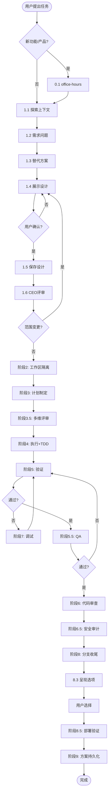

# Superpowers 工作流 — 强制执行协议

> ⚠️ **这是强制执行协议，不是参考文档。执行时必须严格遵守。**

## 执行纪律（必须遵守）

```
┌─────────────────────────────────────────────────────────────┐
│  【铁律】                                                     │
│  1. 阶段1必须交互 — 未获得用户确认，禁止进入阶段2              │
│  2. 步骤不可跳过 — 必须按 0.1→1.1→1.2→...→9.6 顺序执行       │
│  3. Skill必须调用 — 每个步骤必须使用 Skill 工具调用对应文件    │
│  4. 验证失败必须调试 — 阶段5失败→阶段7→修复→返回阶段5        │
└─────────────────────────────────────────────────────────────┘
```

---

## 阶段执行检查清单

### 🔴 阶段 0: 产品探索（可选）

**触发条件**：用户提出新功能想法或产品方向时

| 步骤 | 动作 | Skill 调用 | 完成 |
|-----|------|-----------|------|
| 0.1 | 深度产品探索（YC六问） | `Skill: gstack-office-hours` | ☐ |

**阶段0完成标准**：生成 `docs/plans/YYYY-MM-DD-<topic>-office-hours.md`

---

### 🔴 阶段 1: 头脑风暴（**必须与用户交互**）

**⚠️ 关键规则**：
- 此阶段**必须**与用户交互
- 每完成一个子步骤，**必须**向用户汇报并等待反馈
- 步骤1.4**必须**获得用户明确确认（如"确认"、"同意"、"没问题"）后才能继续
- **未获得确认前，禁止进入阶段2**

| 步骤 | 动作 | Skill 调用 | 完成 | 用户交互 |
|-----|------|-----------|------|---------|
| 1.1 | 探索项目上下文 | `Skill: brainstorming` | ☐ | 汇报发现 |
| 1.2 | 提出需求问题 | `Skill: brainstorming` | ☐ | 逐题询问 |
| 1.3 | 探索替代方案 | `Skill: brainstorming` | ☐ | 展示方案 |
| 1.4 | 展示设计并**获得确认** | `Skill: brainstorming` | ☐ | **必须确认** |
| 1.5 | 保存设计文档 | `Skill: brainstorming` | ☐ | 汇报路径 |

**阶段1完成标准**：
- [ ] 用户明确确认设计（文字确认）
- [ ] 设计文档已保存到 `docs/plans/YYYY-MM-DD-<topic>-design.md`
- [ ] 文档已提交到 git

---

### 🟢 阶段 1.5: CEO评审（自动执行）

| 步骤 | 动作 | Skill 调用 | 完成 |
|-----|------|-----------|------|
| 1.6 | CEO视角需求评审 | `Skill: gstack-plan-ceo-review` | ☐ |

**分支逻辑**：
- 如果范围变更 → **返回阶段1.4重新确认**
- 如果范围不变 → 进入阶段2

---

### 🟢 阶段 2: 工作区隔离（自动执行）

| 步骤 | 动作 | Skill 调用 | 完成 |
|-----|------|-----------|------|
| 2.1 | 检测worktree目录 | `Skill: using-git-worktrees` | ☐ |
| 2.2 | 创建worktree | `Skill: using-git-worktrees` | ☐ |
| 2.3 | 项目初始化 | `Skill: using-git-worktrees` | ☐ |

---

### 🟢 阶段 3: 计划制定（自动执行）

| 步骤 | 动作 | Skill 调用 | 完成 |
|-----|------|-----------|------|
| 3.1 | 映射文件结构 | `Skill: writing-plans` | ☐ |
| 3.2 | 分解微任务 | `Skill: writing-plans` | ☐ |
| 3.3 | 生成依赖图 | `Skill: writing-plans` | ☐ |
| 3.4 | 自审计划 | `Skill: writing-plans` | ☐ |
| 3.5 | 保存计划 | `Skill: writing-plans` | ☐ |

---

### 🟢 阶段 3.5: 多维评审（自动执行）

| 步骤 | 动作 | Skill 调用 | 完成 |
|-----|------|-----------|------|
| 3.6 | 工程架构评审 | `Skill: gstack-plan-eng-review` | ☐ |
| 3.7 | 设计维度评审 | `Skill: gstack-plan-design-review` | ☐ |

---

### 🟢 阶段 4: 执行（自动执行）

| 步骤 | 动作 | Skill 调用 | 完成 |
|-----|------|-----------|------|
| 4.1 | 加载计划并创建任务列表 | `Skill: subagent-driven-development` | ☐ |
| 4.2 | 选择执行模式 | `Skill: subagent-driven-development` | ☐ |
| 4.3 | 执行任务循环 | `Skill: executing-plans` / `dispatching-parallel-agents` | ☐ |
| 4.4 | **TDD实现** | `Skill: test-driven-development` | ☐ |
| 4.5 | 规范审查 | `Skill: subagent-driven-development` | ☐ |
| 4.6 | 代码质量审查 | `Skill: requesting-code-review` | ☐ |
| 4.7 | 最终整体审查 | `Skill: requesting-code-review` | ☐ |

**TDD强制循环（步骤4.4）**：
```
RED → 写失败测试 → GREEN → 写最少代码通过 → REFACTOR → 重构 → 提交
 ↑___________________________________________________________|
```

---

### 🟢 阶段 5: 验证（自动执行）

| 步骤 | 动作 | Skill 调用 | 完成 | 结果 |
|-----|------|-----------|------|------|
| 5.1 | 运行验证证据 | `Skill: verification-before-completion` | ☐ | |
| 5.2 | 检查验证结果 | `Skill: verification-before-completion` | ☐ | 通过/失败 |

**分支逻辑**：
- 通过 → 进入阶段5.5
- **失败 → 进入阶段7调试**

---

### 🟢 阶段 5.5: 页面级QA（Web项目）

| 步骤 | 动作 | Skill 调用 | 完成 |
|-----|------|-----------|------|
| 5.3 | 启动开发服务器 | `Skill: qa` | ☐ |
| 5.4 | 执行QA+设计审查 | `Skill: qa` + `Skill: gstack-design-review` | ☐ |
| 5.5 | 处理QA问题 | `Skill: qa` | ☐ |

**分支逻辑**：
- 发现问题 → **返回阶段5.1重新验证**

---

### 🟢 阶段 6: 代码审查（自动执行）

| 步骤 | 动作 | Skill 调用 | 完成 |
|-----|------|-----------|------|
| 6.1 | 代码审查 | `Skill: requesting-code-review` + `Skill: gstack-review` | ☐ |
| 6.2 | 接收外部审查 | `Skill: receiving-code-review` | ☐ |

---

### 🟢 阶段 6.5: 安全审计（自动执行）

| 步骤 | 动作 | Skill 调用 | 完成 |
|-----|------|-----------|------|
| 6.3 | 安全审计 | `Skill: gstack-cso` | ☐ |

---

### 🟡 阶段 7: 调试（验证失败时执行）

| 步骤 | 动作 | Skill 调用 | 完成 |
|-----|------|-----------|------|
| 7.1 | 收集信息 | `Skill: systematic-debugging` + `Skill: gstack-investigate` | ☐ |
| 7.2 | 形成假设 | `Skill: systematic-debugging` | ☐ |
| 7.3 | 验证假设 | `Skill: systematic-debugging` | ☐ |
| 7.4 | 修复根因 | `Skill: systematic-debugging` | ☐ |

**强制返回**：修复后**必须返回阶段5.1重新验证**

---

### 🔴 阶段 8: 分支收尾（最后交互）

| 步骤 | 动作 | Skill 调用 | 完成 | 用户交互 |
|-----|------|-----------|------|---------|
| 8.1 | 最终验证 | `Skill: finishing-a-development-branch` | ☐ | 无 |
| 8.2 | 清理 | `Skill: finishing-a-development-branch` | ☐ | 无 |
| 8.3 | 呈现选项 | `Skill: finishing-a-development-branch` + `Skill: gstack-ship` | ☐ | **必须选择** |
| 8.4 | 清理worktree | `Skill: finishing-a-development-branch` | ☐ | 无 |

**选项**：
1. 合并
2. 创建PR
3. 保留分支
4. 丢弃分支
5. 🚀 自动发布（/ship）

---

### 🟢 阶段 8.5: 部署验证（可选）

| 步骤 | 动作 | Skill 调用 | 完成 |
|-----|------|-----------|------|
| 8.5 | 合并与部署验证 | `Skill: gstack-land-and-deploy` | ☐ |

---

### 🟢 阶段 9: 方案持久化（自动执行）

| 步骤 | 动作 | Skill 调用 | 完成 |
|-----|------|-----------|------|
| 9.1 | 收集工作产物 | 手动 | ☐ |
| 9.2 | 创建归档目录 | 手动 | ☐ |
| 9.3 | 整理并复制文档 | 手动 | ☐ |
| 9.4 | 生成方案总结 | `Skill: gstack-document-generate` | ☐ |
| 9.5 | 更新方案索引 | 手动 | ☐ |
| 9.6 | 提交归档文档 | 手动 | ☐ |

---

## Skill 文件路径映射

### Superpowers 核心

| Skill | 路径 |
|-------|------|
| brainstorming | `skills/brainstorming/SKILL.md` |
| using-git-worktrees | `skills/using-git-worktrees/SKILL.md` |
| writing-plans | `skills/writing-plans/SKILL.md` |
| executing-plans | `skills/executing-plans/SKILL.md` |
| dispatching-parallel-agents | `skills/dispatching-parallel-agents/SKILL.md` |
| subagent-driven-development | `skills/subagent-driven-development/SKILL.md` |
| test-driven-development | `skills/test-driven-development/SKILL.md` |
| requesting-code-review | `skills/requesting-code-review/SKILL.md` |
| receiving-code-review | `skills/receiving-code-review/SKILL.md` |
| verification-before-completion | `skills/verification-before-completion/SKILL.md` |
| systematic-debugging | `skills/systematic-debugging/SKILL.md` |
| finishing-a-development-branch | `skills/finishing-a-development-branch/SKILL.md` |
| qa | `skills/qa/SKILL.md` |

### gstack 增强

| Skill | 路径 |
|-------|------|
| gstack-office-hours | `skills/gstack-office-hours/SKILL.md` |
| gstack-plan-ceo-review | `skills/gstack-plan-ceo-review/SKILL.md` |
| gstack-plan-eng-review | `skills/gstack-plan-eng-review/SKILL.md` |
| gstack-plan-design-review | `skills/gstack-plan-design-review/SKILL.md` |
| gstack-design-review | `skills/gstack-design-review/SKILL.md` |
| gstack-review | `skills/gstack-review/SKILL.md` |
| gstack-cso | `skills/gstack-cso/SKILL.md` |
| gstack-investigate | `skills/gstack-investigate/SKILL.md` |
| gstack-ship | `skills/gstack-ship/SKILL.md` |
| gstack-land-and-deploy | `skills/gstack-land-and-deploy/SKILL.md` |
| gstack-document-generate | `skills/gstack-document-generate/SKILL.md` |

---

## 执行流程图



---

## 关键检查点

### 检查点1: 阶段1确认
```
必须在步骤1.4获得用户明确确认，如：
- "确认"
- "同意"
- "没问题"
- "继续吧"
```

### 检查点2: 验证失败处理
```
阶段5验证失败 → 必须进入阶段7 → 修复后必须返回阶段5.1
禁止：验证失败后直接继续或跳过调试
```

### 检查点3: QA发现问题
```
阶段5.5 QA发现问题 → 修复后必须重新运行阶段5.1验证
```

### 检查点4: Skill调用
```
每个步骤必须使用 Skill 工具调用对应文件
禁止：只读skill文件而不调用
```
